# Part 1. Настройка gitlab-runner  

### Скачать и установить на виртуальную машину gitlab-runner

* curl -L https://packages.gitlab.com/install/repositories/runner/gitlab-runner/script.deb.sh | sudo bash

* sudo apt install gitlab-runner 

* 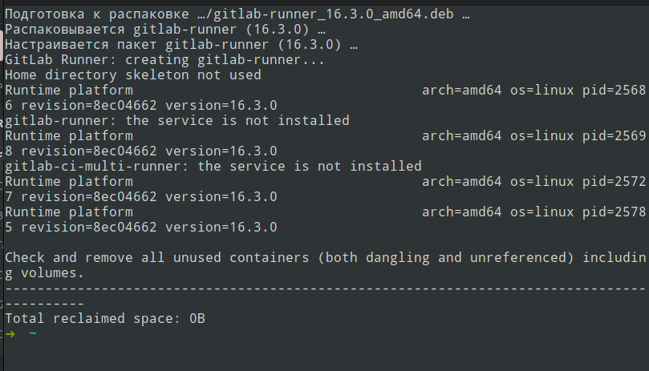  

### Запустить gitlab-runner и зарегистрировать его для использования в текущем проекте (DO6_CICD)

* sudo gitlab-runner start  
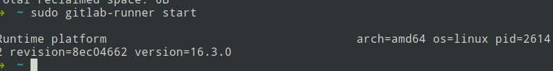  

* sudo gitlab-runner register  
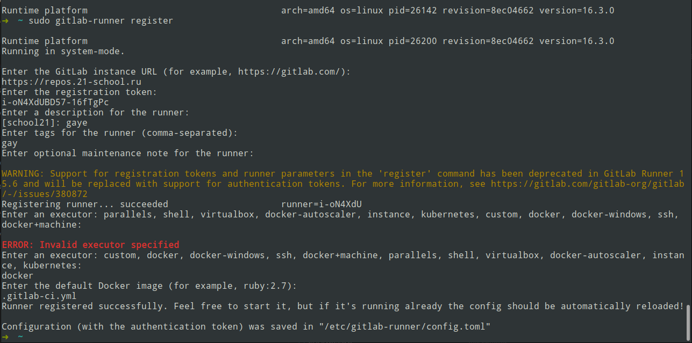  

# Part 2. Сборка

### Написать этап для CI по сборке приложений из проекта C2_SimpleBashUtils:

#### В файле gitlab-ci.yml добавить этап запуска сборки через мейк файл из проекта C2  

#### Файлы, полученные после сборки (артефакты), сохранять в произвольную директорию со сроком хранения 30 дней. 

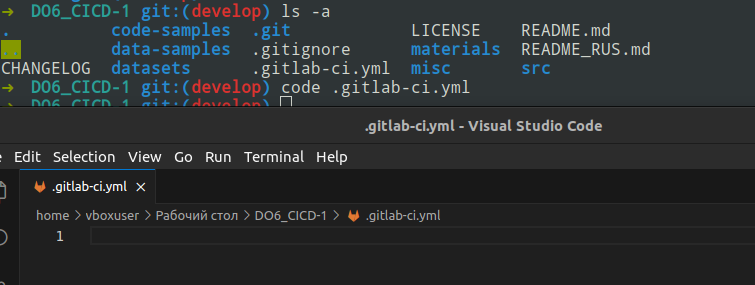   

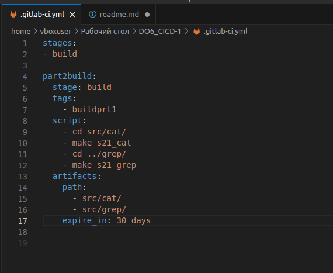  

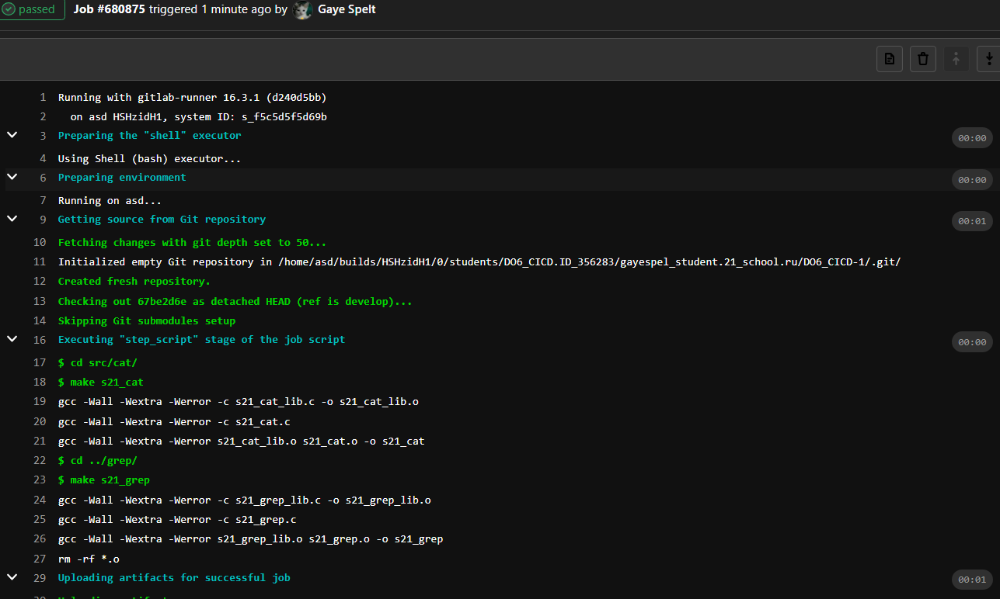

# Part 3. Тест кодстайла

### Написать этап для CI, который запускает скрипт кодстайла (clang-format):

#### Если кодстайл не прошел, то "зафейлить" пайплайн

#### В пайплайне отобразить вывод утилиты clang-format

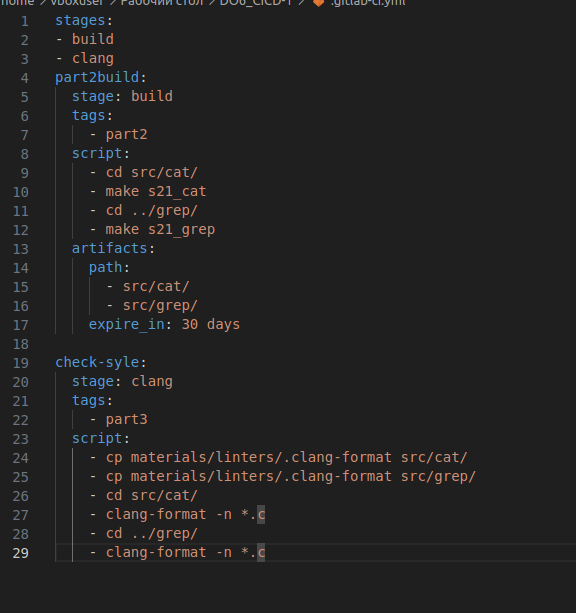  

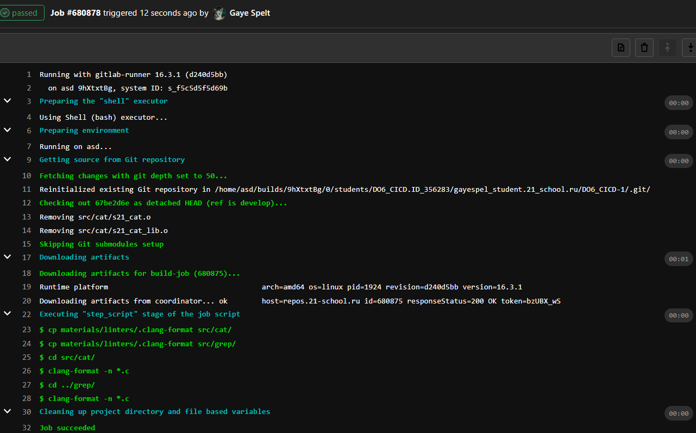

# Part 4. Интеграционные тесты  
### Написать этап для CI, который запускает ваши интеграционные тесты из того же проекта:

#### Запускать этот этап автоматически только при условии, если сборка и тест кодстайла прошли успешно

#### Если тесты не прошли, то "зафейлить" пайплайн

#### В пайплайне отобразить вывод, что интеграционные тесты успешно прошли / провалились  

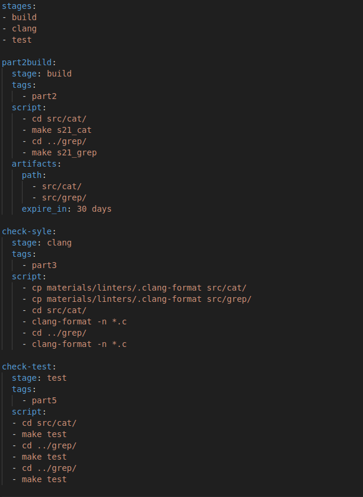  

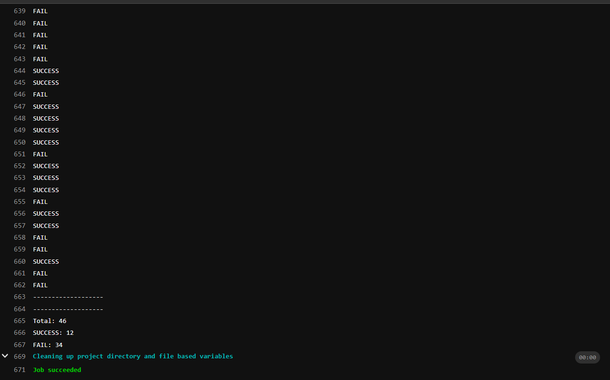

# Part 5. Этап деплоя

#### Поднять вторую виртуальную машину Ubuntu Server 20.04 LTS

* vm1  
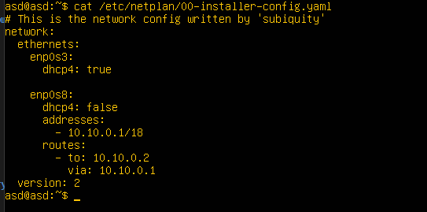
* vm2  
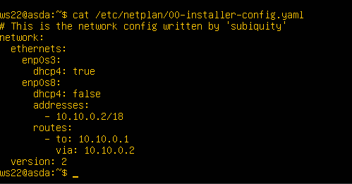  

### Написать этап для CD, который "разворачивает" проект на другой виртуальной машине:  

* 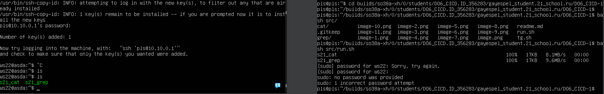  
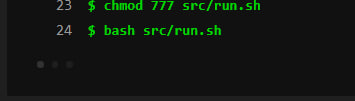  

#### Запускать этот этап вручную при условии, что все предыдущие этапы прошли успешно

#### Написать bash-скрипт, который при помощи ssh и scp копирует файлы, полученные после сборки (артефакты), в директорию /usr/local/bin второй виртуальной машины
#### Тут вам могут помочь знания, полученные в проекте DO2_LinuxNetwork  

#### Будьте готовы объяснить по скрипту, как происходит перенос.

#### В файле gitlab-ci.yml добавить этап запуска написанного скрипта

#### В случае ошибки "зафейлить" пайплайн

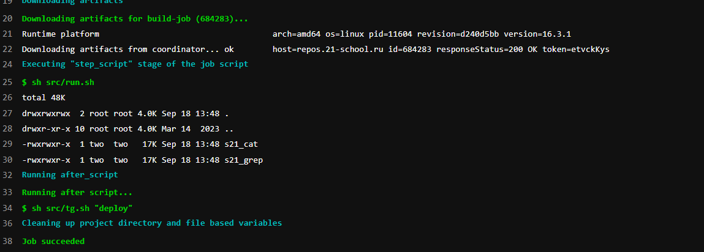

# Part 6. Дополнительно. Уведомления

### Настроить уведомления о успешном/неуспешном выполнении пайплайна через бота с именем "[ваш nickname] DO6 CI/CD" в Telegram
#### Текст уведомления должен содержать информацию об успешности прохождения как этапа CI, так и этапа CD.
#### В остальном текст уведомления может быть произвольным.

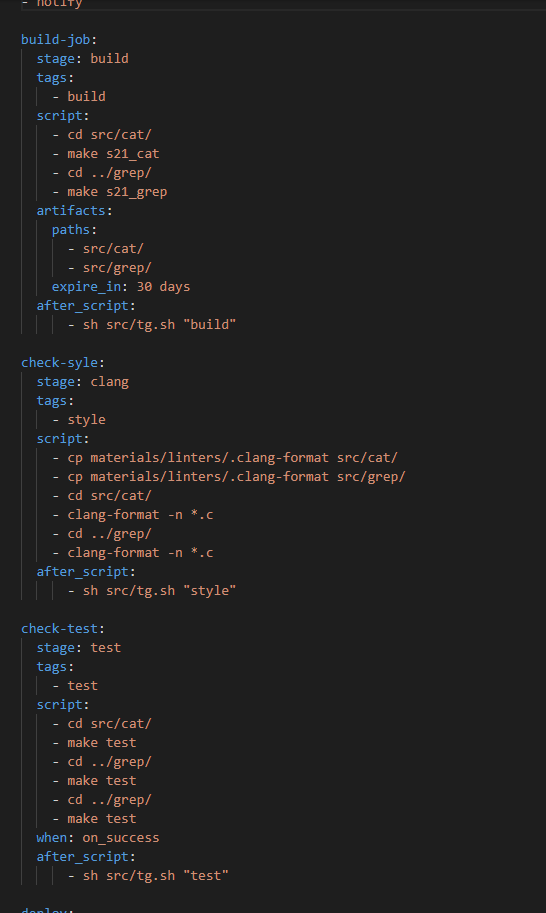  
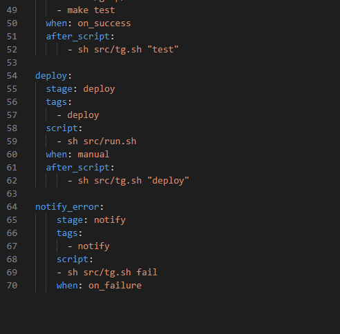   
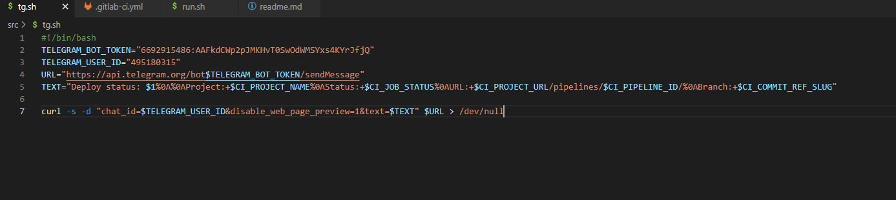

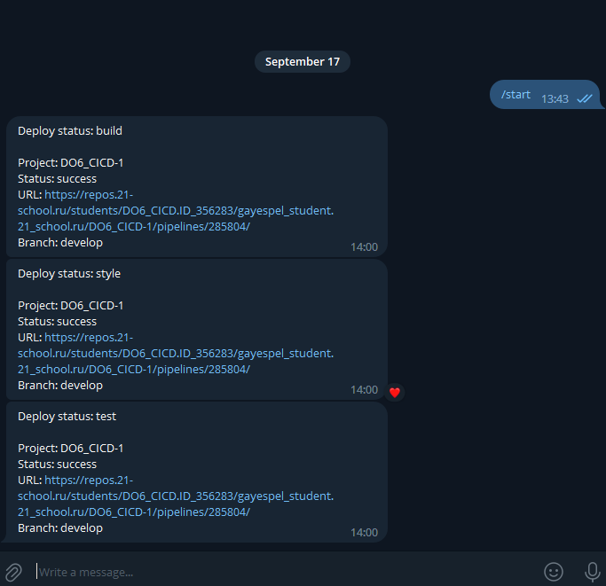  

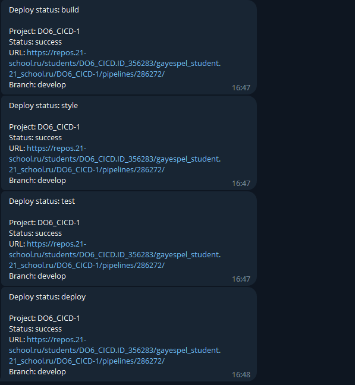