# Part 1. Запуск нескольких docker-контейнеров с использованием docker compose

* 1. Напиши Dockerfile для каждого отдельного микросервиса. Необходимые зависимости описаны в материалах. В отчете отобрази размер собранных образов любого сервиса различными способами.
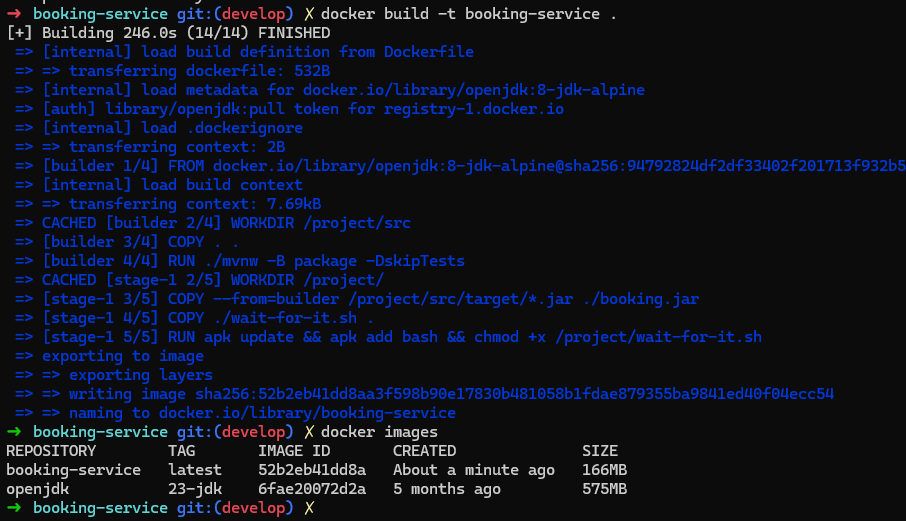  
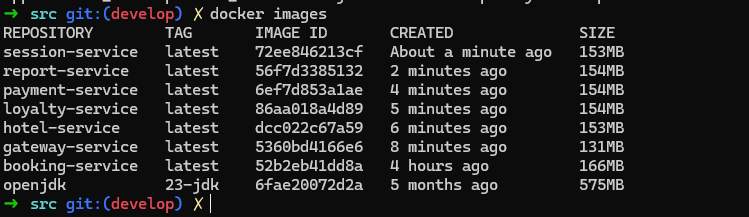

* 2. Напиши docker-compose файл, который осуществляет корректное взаимодействие сервисов. Пробрось порты для доступа к gateway service и session service из локальной машины. Помощь по docker compose ты найдешь в материалах.
  

пробрасываем порты в композе

* 3. Собери и разверни веб-сервис с помощью написанного docker compose файла на локальной машине.  

mvn нам засунули сломанный в проект, помогла команда:  

mvn -N io.takari:maven:wrapper

* 4. Прогони заготовленные тесты через postman и удостоверься, что все они проходят успешно. Инструкцию по запуску тестов можно найти в материалах. В отчете отобрази результаты тестирования.

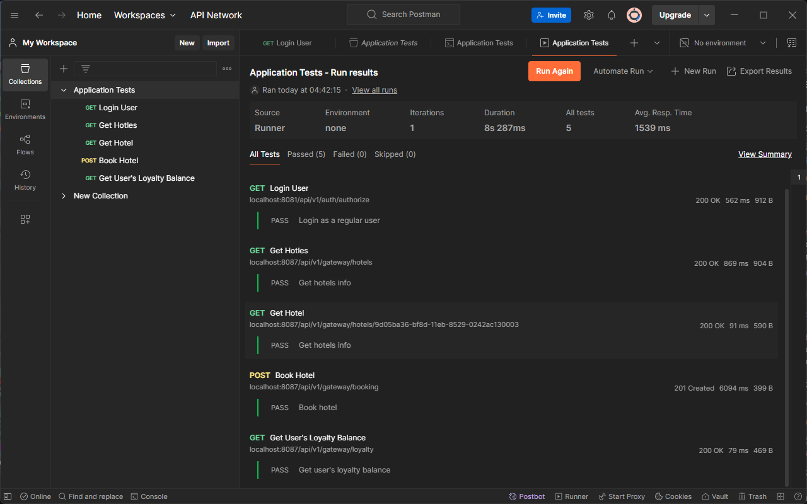

# Part 2. Создание виртуальных машин

 Перешел на виртуал бокс с всл, потому что вагрант не дружит с всл. Все выполнял через прокси, тк вагрантклауд заблочен в РФ. Так же можно обойти блокировку добавив эту строчку в начале.  
 
  ENV['VAGRANT_SERVER_URL'] = 'http://vagrant.elab.pro'

* 1. Установи и инициализируй Vagrant в корне проекта. Напиши Vagrantfile для одной виртуальной машины. Перенеси в виртуальную машину исходный код веб-сервиса в рабочую директорию виртуальной машины. Помощь по vagrant ты найдешь в материалах.  

Vagrant init  

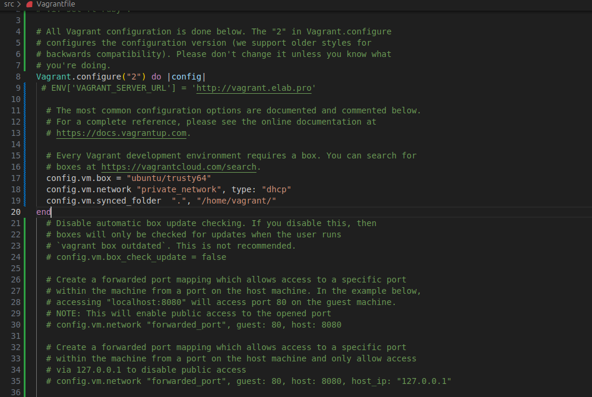

* 2. Зайди через консоль внутрь виртуальной машины и удостоверься, что исходный код встал, куда нужно. Останови и уничтожь виртуальную машину.   

vagrant ssh  

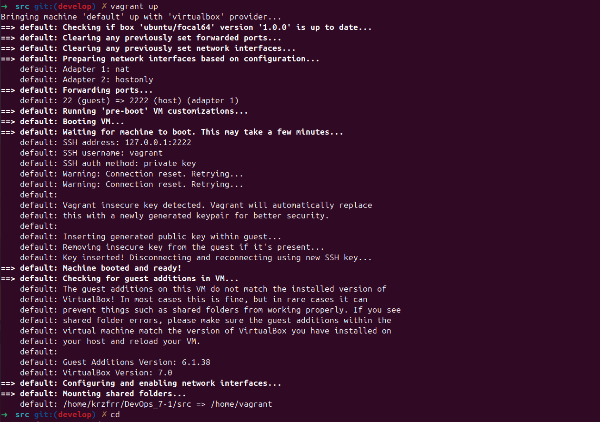  

config.vm.synced_folder ".", "/home/vagrant/" - общая папка

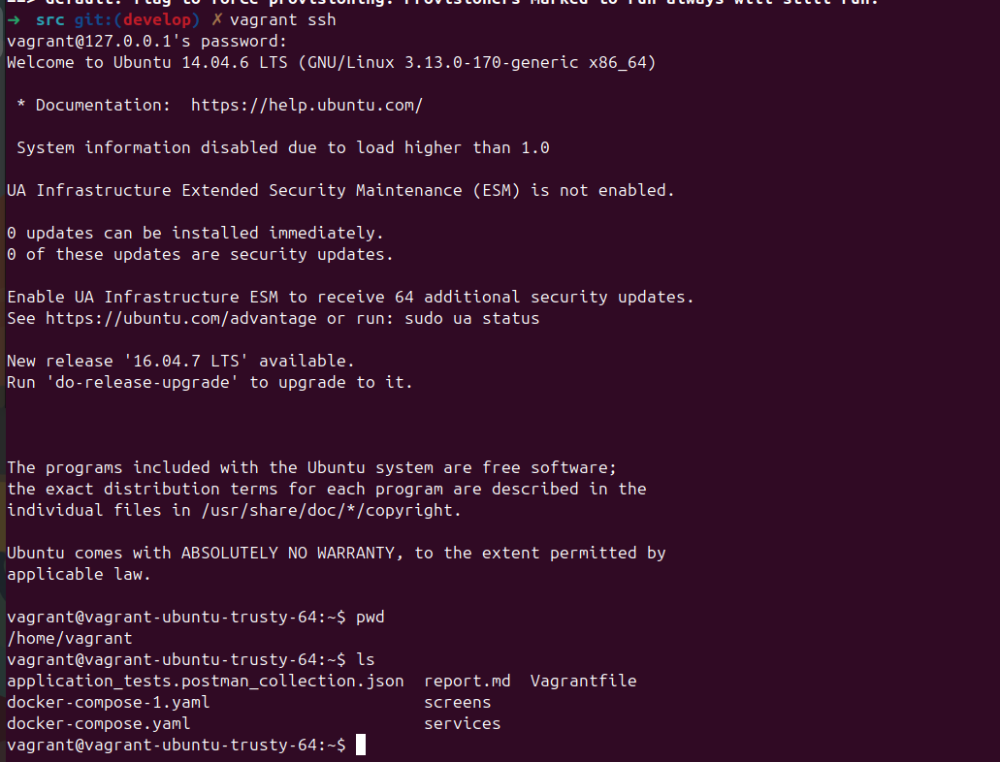  

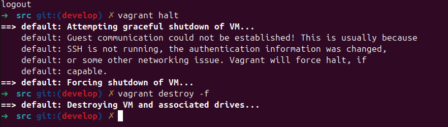

# Part 3. Создание простейшего docker swarm

* 1. Модифицируй Vagrantfile для создания трех машин: manager01, worker01, worker02. Напиши shell-скрипты для установки docker внутрь машин, инициализации и подключения к docker swarm. Помощь с docker swarm ты найдешь в материалах.  

в шелл скриптах токены делаем и установку докера

* 2. Загрузи собранные образы на docker hub и модифицировать docker-compose файл для подгрузки расположенных на docker hub образов.
  
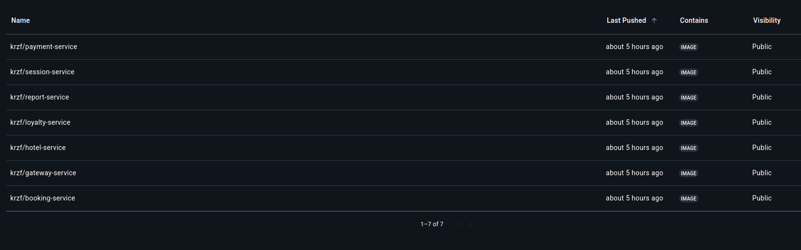

* 3. Подними виртуальные машины и перенести на менеджер docker-compose файл. Запусти стек сервисов, используя написанный docker-compose файл.  

Сначала пытался командой scp -i .vagrant/machines/manager01/virtualbox/private_key docker-compose.yaml vagrant@192.168.50.10:/home/vagrant/

потом просто перешел по пути /vagrant где есть наш проект, так же он потребовал чтобы в environment не было знаков, пришлось делать для каждого сервиса .env файл в композе
  

  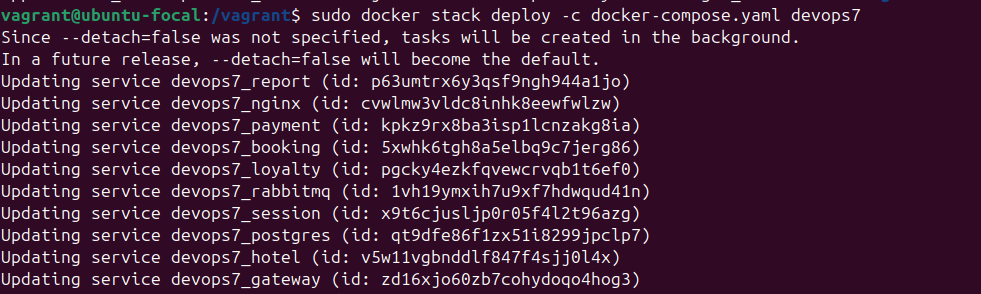  

* 4. Настрой прокси на базе nginx для доступа к gateway service и session service по оверлейной сети. Сами gateway service и session service сделай недоступными напрямую.  

оставил nginx в проекте, запускал в менджерe по папке вагранта, на машину качаем nginx, затем рестартим его после деплоя  

  
  
  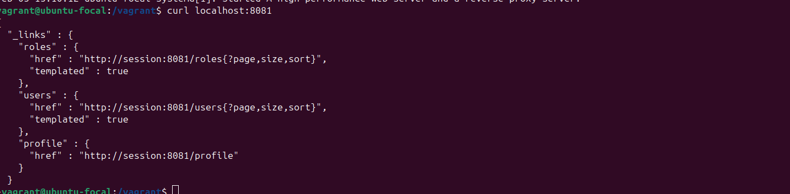

* 5. Прогони заготовленные тесты через postman и удостоверься, что все они проходят успешно. В отчете отобрази результаты тестирования.
  

  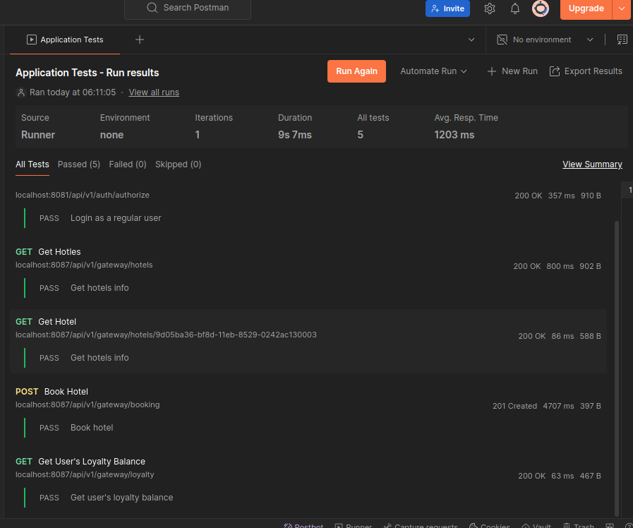

* 6. Используя команды docker, отобрази в отчете распределение контейнеров по узлам.  

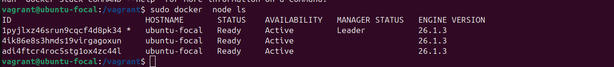  

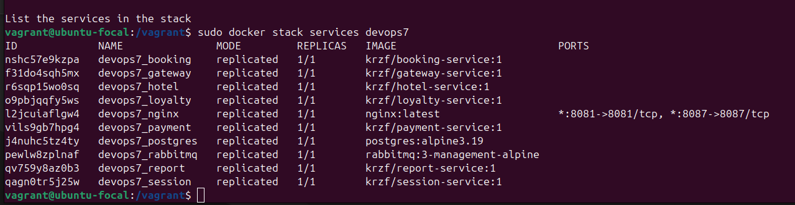

* 7. Установи отдельным стеком Portainer внутри кластера. В отчете отобрази визуализацию распределения задач по узлам с помощью Portainer.   

curl -L https://downloads.portainer.io/ee2-19/portainer-agent-stack.yml -o portainer-agent-stack.yml  

docker stack deploy -c portainer-agent-stack.yml portainer  

Вход http://localhost:9000/

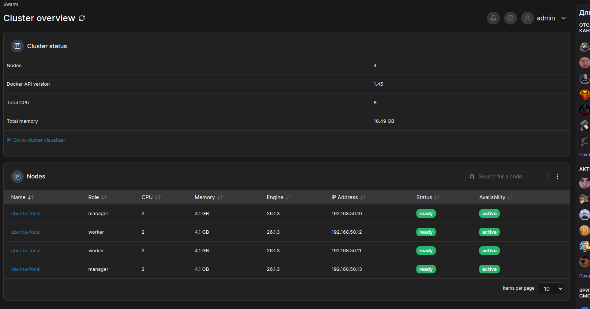  

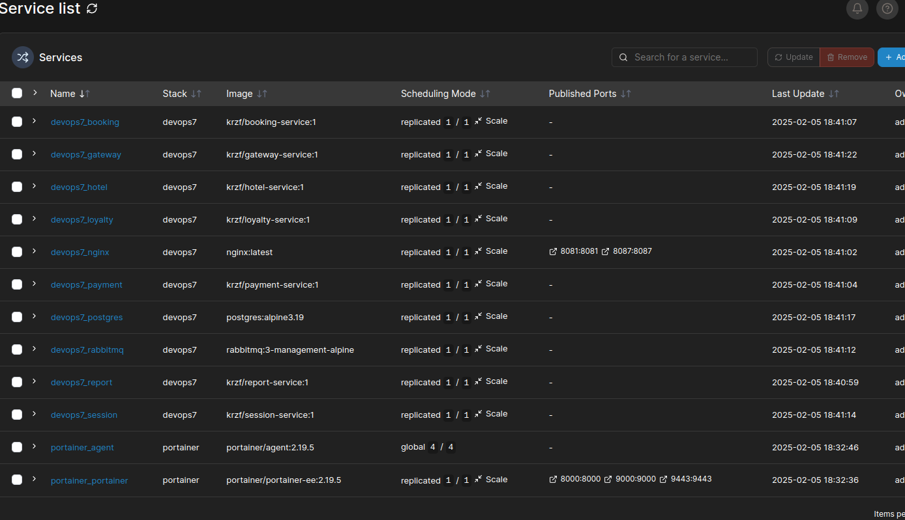  

[text](Vagrantfile)
