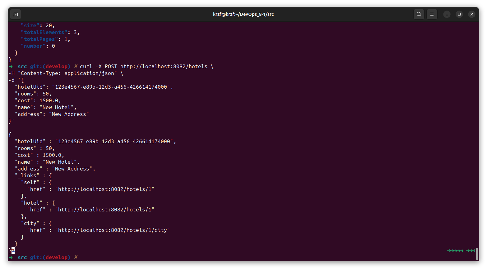

# Part 1. Удаленное конфигурирование узла через Ansible

/etc/ssh/sshd_config на наличие строчки PasswordAuthentication yes 
коммичу строчку

* Зайти на manager.
* На manager проверить подключение к node01 через ssh по приватной сети.
* Сгенерировать ssh-ключ для подключения к node01 из manager (без passphrase).  

  

  

* Установить Ansible на менеджер и создать папку ansible, в которой создать inventory-файл.
* Использовать модуль ping для проверки подключения через Ansible.
* Результат выполнения модуля поместить в отчет.   

sudo add-apt-repository ppa:ansible/ansible  

sudo apt update  

sudo apt install ansible  

  

3. Написать первый плейбук для Ansible, который выполняет apt update, устанавливает docker, docker-compose, копирует compose-файл из manager'а и разворачивает микросервисное приложение.  

  

Здесь у меня через деплой, с прошлого проекта используется nginx для проксирования зачем то, можно убрать и поставить компоуз в ТЗ не написано как нужно. Можно и так и так.

4. Прогнать заготовленные тесты через postman и удостовериться, что все они проходят успешно. В отчете отобразить результаты тестирования.  

5. Сформировать три роли:

* роль application выполняет развертывание микросервисного приложения при помощи docker-compose,
* apache устанавливает и запускает стандартный apache сервер
* postgres устанавливает и запускает postgres, создает базу данных с произвольной таблицей и добавляет в нее три произвольные записи.
* Назначить первую роль node01 и вторые две роли node02, проверить postman-тестами работоспособность микросервисного приложения, удостовериться в доступности postgres и apache-сервера. Для Apache веб-страница должна открыться в браузере. Что касается PostgreSQL, необходимо подключиться с локальной машины и отобразить содержимое ранее созданной таблицы с данными.
  
меняем конфиг чтобы не запрашивал пароль, какие то с ним проблемы  

  

  

  

  

для подключение к БД с локльной машины:  
на виртаулке  
sudo nano /etc/postgresql/12/main/pg_hba.conf  
разрешаем для локальной машины подключение без пароля  
host    all             all             0.0.0.0/0               trust  
sudo nano /etc/postgresql/12/main/postgresql.conf   
listen_addresses = '*'  
sudo systemctl restart postgresql  
и подключаемся  psql -h 192.168.50.12 -U postgres -d postgres

Созданные в этом разделе файлы разместить в папке src\ansible01 в личном репозитории.

# Part 2. Service Discovery  

1. Написать два конфигурационный файла для consul (информация по consul в материалах):
  

2. Создать с помощью Vagrant четыре машины - consul_server, api, manager и db.

3. Написать плейбук для ansible и четыре роли:    
/ansible02  
  

4. Проверить работоспособность CRUD-операций над сервисом отелей. В отчете отобразить результаты тестирования.  

наш сервис  
  

наш консул на порте 8500  
 
проверяем доступность микросервиса  
  

  
круд тесты гет пост  
  

  
круд тесты гет пост  в постмане  

 

